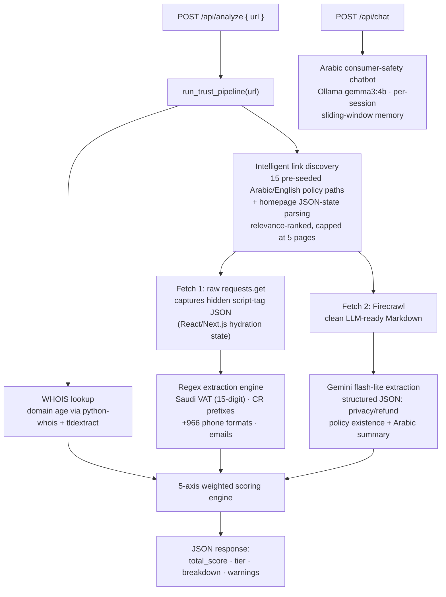

<div align="center">

# Realtime Dual-Fetch Hybrid LLM Trust Scorer

### Live URL → structured 100-point trust report, in seconds

[](https://python.org)
[](https://fastapi.tiangolo.com)
[](https://aistudio.google.com)
[](https://ollama.com)
[](https://firecrawl.dev)
[](LICENSE)

**A real-time AI microservice that evaluates the trustworthiness of Arabic e-commerce stores. No pre-built database, no cached verdicts — every analysis fetches, scrapes, extracts, and reasons about the store live.**

</div>

---

## The Core Idea: Two Extraction Engines That Cover Each Other's Blind Spots

| Strategy | Tools | Extracts | Blind Spot Covered |
|---|---|---|---|
| **Structural regex** | `re`, `tldextract`, `python-whois` | Saudi phone numbers, VAT IDs, Commercial Registration numbers, domain age | LLMs hallucinate/miss exact ID formats |
| **Semantic LLM** | Google Gemini `flash-lite` | Privacy & refund policy existence + Arabic summaries | Regex cannot judge meaning |

Both engines feed a **5-axis weighted scoring engine** that returns a 0–100 score, a tier, per-axis breakdown, and actionable warnings — from a single API call.

---

## Pipeline Architecture



---

## Scoring Engine

Five independent axes combine into the final 0–100 score. All **192 scenario combinations** are documented in [`Final_AI_Server/ANALYZER_SCENARIOS_AR.md`](Final_AI_Server/ANALYZER_SCENARIOS_AR.md):

| Axis | Max Points | Signal |
|---|---|---|
| `legal_identity` | 40 | Commercial Registration + VAT number presence |
| `domain_longevity` | 25 | WHOIS age (≥3yr = 25, ≥1yr = 15, ≥6mo = 10) |
| `contactability` | 15 | Phone + email availability |
| `transparency` | 20 | Privacy & refund policies (10 each) |
| `penalties` | −40 | **"Ghost Syndrome"**: new domain + no CR + no phone |

```
≥ 85 → 🟢 Trusted & Secure
≥ 60 → 🟡 Proceed with Caution
< 60 → 🔴 High Risk / Suspicious
```

### Saudi-Regulatory Regex Patterns

```python
PHONE_PATTERN  = r'(?:\+966|00966)[ \-]?(?:5[0-9]{8}|9200[0-9]{5})|05[0-9]{8}'
VAT_PATTERN    = r'\b3[0-9]{14}\b'                    # Saudi VAT: 15 digits, starts with 3
CR_PATTERN     = r'\b(?:10|11|20|40|50)[0-9]{8}\b'    # Commercial Registration prefixes
EMAIL_PATTERN  = r'[a-zA-Z0-9._%+\-]+@[a-zA-Z0-9.\-]+\.[a-zA-Z]{2,}'
```

---

## API Reference

### `POST /api/analyze` — real-time trust evaluation

```bash
curl -X POST http://localhost:8000/api/analyze \
     -H "Content-Type: application/json" \
     -d '{"url": "https://example-store.com"}'
```

```json
{
  "status": "success",
  "extracted_data": {
    "regex_matches": {
      "phone": ["+966512345678"],
      "vat_number": ["310122345600003"],
      "commercial_reg": ["1010123456"]
    },
    "ai_analysis": {
      "privacy_policy": { "exists": true, "summary": "سياسة خصوصية شاملة..." },
      "refund_policy":  { "exists": true, "summary": "يمكن الإرجاع خلال 14 يوم..." }
    }
  },
  "trust_evaluation": {
    "total_score": 100,
    "tier": "Trusted & Secure",
    "breakdown": {
      "legal_identity": 40, "domain_longevity": 25,
      "contactability": 15, "transparency": 20, "penalties": 0
    },
    "warnings": []
  }
}
```

### `POST /api/chat` — Arabic consumer-safety advisor

Session-aware chatbot on **local Ollama (`gemma3:4b`)** — each session keeps independent history through a **sliding-window memory manager** that prevents context overflow while preserving relevant turns.

```bash
curl -X POST http://localhost:8000/api/chat \
     -H "Content-Type: application/json" \
     -d '{"session_id": "user_123", "message": "ما هو السجل التجاري؟"}'
```

---

## Engineering Details

- **Dual-fetch design:** each candidate page is fetched twice on purpose — raw HTML (feeds regex; captures hidden React/Next.js JSON state that Markdown renderers drop) and Firecrawl Markdown (feeds Gemini; strips nav/ads/boilerplate). Each consumer gets the representation it works best on.
- **Operational hygiene:** structured file + console logging (`logger_config.py`), CSV request logging, CORS configuration, `.env`-templated secrets, Pydantic request/response validation.
- **Live integration tests:** `tests/test_client.py` exercises both endpoints — chatbot session-memory behavior plus full live analyses of real stores.

---

## Quick Start

| Requirement | Notes |
|---|---|
| Python 3.10+ | — |
| Ollama | must be running locally (`ollama pull gemma3:4b`, ~2.5 GB) |
| Gemini API key | free tier at [aistudio.google.com](https://aistudio.google.com/app/apikey) |
| Firecrawl API key | free tier at [firecrawl.dev](https://www.firecrawl.dev/app/api-keys) |

```bash
git clone https://github.com/YazanAi-Dev3/Realtime-Dual-Fetch-Hybrid-LLM-Trust-Scorer.git
cd Realtime-Dual-Fetch-Hybrid-LLM-Trust-Scorer/Final_AI_Server

pip install -r requirements.txt
cp ../.env.example .env    # fill GEMINI_API_KEY and FIRECRAWL_API_KEY
ollama pull gemma3:4b
python main.py
```

Interactive API docs at `http://localhost:8000/docs`.

---

## Project Structure

```
Realtime-Dual-Fetch-Hybrid-LLM-Trust-Scorer/
├── .env.example
└── Final_AI_Server/
    ├── main.py                     # FastAPI app: CORS, CSV logging, endpoints
    ├── config.py                   # dotenv-driven configuration
    ├── logger_config.py            # structured file + console logging
    ├── ANALYZER_SCENARIOS_AR.md    # full scoring logic — all 192 scenarios (Arabic)
    ├── core/
    │   ├── analyzer_engine.py      # THE pipeline: scrape → extract → score
    │   └── chatbot_engine.py       # ChatbotManager + sliding-window memory
    └── tests/
        └── test_client.py          # live integration test client
```

---

## Tech Stack

| Layer | Technology | Role |
|---|---|---|
| API | FastAPI + Uvicorn + Pydantic | ASGI server, validation, CORS |
| Scraping | requests + Firecrawl + BeautifulSoup4 | dual-fetch raw HTML & clean Markdown |
| LLM (cloud) | Google Gemini flash-lite | semantic policy extraction |
| LLM (local) | Ollama gemma3:4b | privacy-preserving Arabic chatbot |
| OSINT | python-whois + tldextract | domain age verification |
| Logging | Python logging + CSV audit | traceability |

---

## License

MIT — see [LICENSE](LICENSE).
